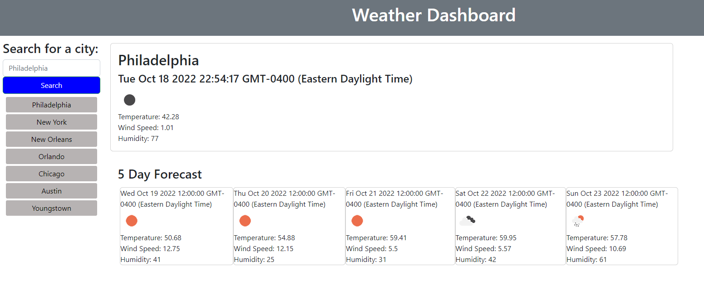

# Weather Dashboard

## Description 
The goal of this project was to create a weather dashboard. The user is able to search for a city and the dashboard will display the current weather as well as the 5 day forecast. This data is sourced from the OpenWeather API. The dashboard will also store the user's recent city searches. Technologies used were HTML, CSS, and JavaScript. 

## Site Image

To visit the site click [here](https://samanthajanedavidson.github.io/weather-dashboard/). 

## License
Please refer to the license in the repo. 